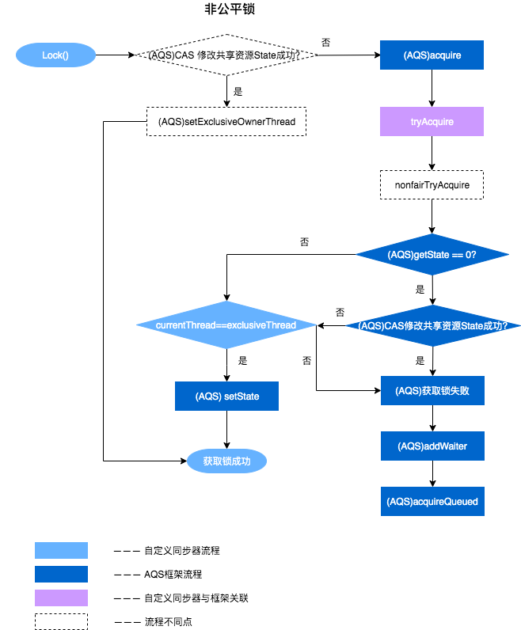

## 1、AQS 是什么？

*   AQS 是 AbstractQueuedSynchronizer 的缩写，直译为抽象队列同步器，是用来构建锁和同步器的框架
*   它使用一个 int 成员变量 state 表示同步状态，通过改进的 CHL 队列来完成资源获取线程的管理
*   改进的 CHL 队列实现采用懒加载带有 dummyHead 的双向链表实现
*   常用的 ReentrantLock、Semaphore、CountDownLatch 等都是基于此框架快速实现（模板方法模式）


## 2、AQS 整体框架


-   上图中有颜色的为Method，无颜色的为Attribution。
-   总的来说，AQS框架共分为五层，自上而下由浅入深，从AQS对外暴露的API到底层基础数据。
-   当有自定义同步器接入时，只需`重写第一层`所需要的部分方法即可，不需要关注底层具体的实现流程。当自定义同步器进行加锁或者解锁操作时，先经过第一层的API进入AQS内部方法，然后经过第二层进行锁的获取，接着对于获取锁失败的流程，进入第三层和第四层的等待队列处理，而这些处理方式均依赖于第五层的基础数据提供层。


## 3、AQS 使用方式（以 ReentrantLock 为例）

ReentrantLock 是 JUC 并发包中提供的可重入锁，通过设置 state 与 AQS 进行交互，从而完成可重入锁的功能。ReentrantLock 具有公平和非公平获取锁的方式，组合的 Sync 继承自 AQS。


*   以非公平方式获取锁（ReentrantLock 默认是非公平方式），具体调用逻辑如下，其中蓝色表示自定义同步器的逻辑，紫色表示 AQS 的框架流程。可以看到 ReentrantLock 实现的主要是 tryAcquire 和 tryRelease。


*   以公平方式获取锁，仅仅去需要将上图的 ReentrantLock.NonfairSync#tryAcquire 和 ReentrantLock.Sync#nonfairTryAcquire 替换成 ReentrantLock.FairSync#tryAcquire 即可

__小结__：实际上有了 AQS ，我们需要实现的函数只有以下5个，一般不需要全部实现，tryAcquire-tryRelease 和 tryAcquireShared-tryReleaseShared 一般实现一对即可。特别的，ReentrantReadWriteLock 既实现了独占获取，也实现了共享获取。

| 方法名                                      | 描述                                                         |
| :------------------------------------------ | :----------------------------------------------------------- |
| protected boolean isHeldExclusively()       | 该线程是否正在独占资源。只有用到Condition才需要去实现它。    |
| protected boolean tryAcquire(int arg)       | 独占方式。arg为获取锁的次数，尝试获取资源，成功则返回True，失败则返回False。 |
| protected boolean tryRelease(int arg)       | 独占方式。arg为释放锁的次数，尝试释放资源，成功则返回True，失败则返回False。 |
| protected int tryAcquireShared(int arg)     | 共享方式。arg为获取锁的次数，尝试获取资源。负数表示失败；0表示成功，但没有剩余可用资源；正数表示成功，且有剩余资源。 |
| protected boolean tryReleaseShared(int arg) | 共享方式。arg为释放锁的次数，尝试释放资源，如果释放后允许唤醒后续等待结点返回True，否则返回False。 |


## 4、AQS 源码的内部实现

### 4.1、AQS 中队列数据结构组成

*   请求资源的线程在资源获取不到的情况下入队，不会直接将线程入队，而是将线程保存在Node节点中，然后入队

Node 类的定义：

```java
static final class Node {
    static final Node SHARED = new Node(); // 共享，多个线程可以同时执行，如 Semaphore
    static final Node EXCLUSIVE = null;    // 独占，只有一个线程可以执行，如 ReentrantLock

    static final int CANCELLED =  1;
    static final int SIGNAL    = -1;
    static final int CONDITION = -2;
    static final int PROPAGATE = -3;

    volatile int waitStatus; // 5 种状态
    volatile Node prev;
    volatile Node next;
    volatile Thread thread;
    Node nextWaiter;         // 存储在 condition 队列中的后继节点

    final boolean isShared() {
        return nextWaiter == SHARED;
    }

    final Node predecessor() throws NullPointerException {
        Node p = prev;
        if (p == null)
            throw new NullPointerException();
        else
            return p;
    }

    Node() {    // Used to establish initial head or SHARED marker
    }

    Node(Thread thread, Node mode) {     // Used by addWaiter
        this.nextWaiter = mode;
        this.thread = thread;
    }

    Node(Thread thread, int waitStatus) { // Used by Condition
        this.waitStatus = waitStatus;
        this.thread = thread;
    }
}
```

这里的定义很清晰，主要需要注意节点的状态，也就是 waitStatus，在 Node 中定义了4种状态，还有一种初始状态0，具体说明入下：

| 状态              | 状态说明                                                     |
| ----------------- | ------------------------------------------------------------ |
| **CANCELLED**(1)  | 表示当前结点已取消调度。当 timeout 或被中断（响应中断的情况下），会触发变更为此状态，进入该状态后的结点将不会再变化。 |
| **SIGNAL**(-1)    | 表示后继结点在等待当前结点唤醒。在当前节点释放的时候需要unpark后继节点。后继结点入队时，会将前继结点的状态更新为 SIGNAL。 |
| **CONDITION**(-2) | 表示结点等待在 Condition 上，当其他线程调用了 Condition 的 signal() 方法后，CONDITION 状态的结点将**从等待队列转移到同步队列中**，等待获取同步锁。 |
| **PROPAGATE**(-3) | 共享模式下，前继结点不仅会唤醒其后继结点，同时也可能会唤醒后继的后继结点。 |
| 0                 | 新结点入队时的默认状态。                                     |


队列示意图：


### 4.2、AQS 源码解读之加锁操作（独占模式）

这里继续以 ReentrantLock 非公平实现来看 AQS 框架运作原理（但不失一般性），首先看整体运作流程



注（图中存在连接错误）：**(AQS)CAS修改共享资源State成功？**`是` 应该连接到获取锁成功

#### 4.2.1、ReentrantLock 静态内部类 NonfairSync 中的 lock 函数

```java
final void lock() {
    if (compareAndSetState(0, 1)) // 先尝试抢占一次锁
        setExclusiveOwnerThread(Thread.currentThread());
    else
        acquire(1);               // 第一次抢占锁不成功走 acquire 逻辑
}
```


#### 4.2.2、AQS 的 acquire 函数

```java
// 独占方式获取锁，忽略中断，如有中断，结束前补上中断
// 尝试失败，调用 addWaiter 加入到队列尾部
public final void acquire(int arg) {
    if (!tryAcquire(arg) &&                           // 尝试获取一次，非公平和公平实现方式由具体自定义同步器实现        
        acquireQueued(addWaiter(Node.EXCLUSIVE), arg))
        selfInterrupt();
}
```


#### 4.2.3、ReentrantLock 静态内部类 NonfairSync 中的 tryAcquire 函数

```java
protected final boolean tryAcquire(int acquires) {
    return nonfairTryAcquire(acquires);
}
```


#### 4.2.4、ReentrantLock 静态内部类 Sync 中的 nonfairTryAcquire 函数

```java
final boolean nonfairTryAcquire(int acquires) {
    final Thread current = Thread.currentThread();
    int c = getState();
    if (c == 0) {      // 此时 state 正好被释放，入队前再尝试抢占一次
        if (compareAndSetState(0, acquires)) {
            setExclusiveOwnerThread(current);
            return true;
        }
    }
    else if (current == getExclusiveOwnerThread()) {
        int nextc = c + acquires;
        if (nextc < 0) // overflow
            throw new Error("Maximum lock count exceeded");
        setState(nextc);
        return true;
    }
    return false;
}
```


#### 4.2.5、AQS 的 addWaiter 函数

```java
// 将节点加入到队列尾部并返回这个新节点
// 如果当前队列没有 dummyHead，也就是 pred == null，只能走 enq，否则尝试直接插入队尾
private Node addWaiter(Node mode) {
    Node node = new Node(Thread.currentThread(), mode);
    Node pred = tail;
    if (pred != null) {  // 尝试将新节点快速插入队尾方式
        node.prev = pred;
        if (compareAndSetTail(pred, node)) {
            pred.next = node;
            return node;
        }
    }
    enq(node);           // 失败，调用 enq 入队
    return node;
}
```


#### 4.2.6、AQS 的 enq 函数

```java
// 将节点插入队列，如果先前没有创建 dummyHead，新建一个
private Node enq(final Node node) {
    for (;;) {
        Node t = tail;
        if (t == null) { // Must initialize
            if (compareAndSetHead(new Node())) // 自旋 + cas 方式保证一定创建一个 dummyHead
                tail = head;
        } else {
            node.prev = t;
            if (compareAndSetTail(t, node)) {  // 自旋 + cas 方式保证新节点一定加入到队列尾部
                t.next = node;
                return t;
            }
        }
    }
}
```


#### 4.2.7、AQS 的 acquireQueued 函数

```java
// 对于 node，判断他是否处于队列中的第一个节点（dummyHead 后的第一个节点），如果是，使用 tryAcquire 尝试获取资源
// 获取资源成功，node 节点的线程将完成它对应的操作，此时 AQS 内部将 head 重新设置为 node
// 如果不是队列中的第一个节点，那么判断是否需要 park
final boolean acquireQueued(final Node node, int arg) {
    boolean failed = true;
    try {
        boolean interrupted = false;
        for (;;) {
            final Node p = node.predecessor();
            if (p == head && tryAcquire(arg)) {
                setHead(node);
                p.next = null; // help GC
                failed = false;
                return interrupted;
            }
            if (shouldParkAfterFailedAcquire(p, node) && // 为了避免长时间自旋造成性能消耗，看看能否 park 当前线程（node）
                parkAndCheckInterrupt())                 // 进入waiting状态，直到被unpark()
                interrupted = true;
        }
    } finally {
        if (failed)
            cancelAcquire(node);
    }
}
```

**Q：什么情况下会调用cancelAcquire方法？**

**A：当函数中抛出异常的时且 failed == true 时会调用此方法**


#### 4.2.8、AQS 的 setHead 函数

```java
// 朴实无华的更新头节点的操作
private void setHead(Node node) {
    head = node;
    node.thread = null;
    node.prev = null;
}
```


#### 4.2.9、AQS 的 shouldParkAfterFailedAcquire 函数

讲解如下代码前先回顾下线程的状态切换


```java
// 检查与更新 pred 节点的状态（此时 node 没有获取到资源）
// 如果可以 park，返回 true
private static boolean shouldParkAfterFailedAcquire(Node pred, Node node) {
    int ws = pred.waitStatus;
    if (ws == Node.SIGNAL)
        return true; // pred 的 waitStatus 是 Node.SIGNAL，表示释放资源时会唤醒 node，因此 node 可以放心的去休息了
    if (ws > 0) {    // 如果被取消，那么通过 do-while 将所有的 cancelled 节点跳过并重新连接，保证 pred 的 waitStatus <= 0
        do {
            node.prev = pred = pred.prev;
        } while (pred.waitStatus > 0);
        pred.next = node;
    } else {
        /*
         * waitStatus must be 0 or PROPAGATE.  Indicate that we
         * need a signal, but don't park yet.  Caller will need to
         * retry to make sure it cannot acquire before parking.
         */
        // 将 pred 的 waitStatus 设置为 Node.SIGNAL，按道理这里 node 节点应该可以休息，但这里后面返回 false 
        // 原因如上注释，是为了再进行一次 tryAcquire，确保无法获取资源后再 park
        // 这么设计是为了减少频繁的 park 和 unpark 操作造成的延迟和资源浪费
        compareAndSetWaitStatus(pred, ws, Node.SIGNAL); 
    }
    return false;
}
```


```java
// park 当前线程，使其休息
private final boolean parkAndCheckInterrupt() {
    LockSupport.park(this);
    return Thread.interrupted();
}
```


#### 4.2.10、AQS 的 cancelAcquire 函数

```java
// 如果获取失败，使用 cancelAcquire 将节点的 waitStatus 的状态设置为 Node.CANCELLED
private void cancelAcquire(Node node) {
    // Ignore if node doesn't exist
    if (node == null)
        return;
    node.thread = null;
    // Skip cancelled predecessors
    Node pred = node.prev;
    while (pred.waitStatus > 0)
        node.prev = pred = pred.prev;

    // predNext is the apparent node to unsplice. CASes below will
    // fail if not, in which case, we lost race vs another cancel
    // or signal, so no further action is necessary.
    // 获取过滤后的前驱节点的后继节点
    Node predNext = pred.next;

    // Can use unconditional write instead of CAS here.
    // After this atomic step, other Nodes can skip past us.
    // Before, we are free of interference from other threads.
    // 将当前节点的状态设置为 Node.CANCELLED;
    node.waitStatus = Node.CANCELLED;

    // 针对当前节点 node 的所处状态，采取相应的措施
    if (node == tail && compareAndSetTail(node, pred)) { // 如果 node 是尾节点，直接将 pred.next 设置为 null 
        compareAndSetNext(pred, predNext, null);
    } else {    // 如果 node 是队列中非尾节点，需要进行链表重新连接
        // If successor needs signal, try to set pred's next-link
        // so it will get one. Otherwise wake it up to propagate.
        int ws;
        if (pred != head &&                              // node 不是队列第一个节点，即中间节点
            ((ws = pred.waitStatus) == Node.SIGNAL ||    // node 的前驱节点状态是 Node.SIGNAL
             (ws <= 0 && compareAndSetWaitStatus(pred, ws, Node.SIGNAL))) && // 此时前驱节点不是取消状态，将其状态设置成 Node.SIGNAL
            pred.thread != null) {                       // 前驱节点的线程不为 null，也就是有效节点
            Node next = node.next;                       // 获取当前节点的后继
            if (next != null && next.waitStatus <= 0)    // 后继存在且状态不是取消状态
                compareAndSetNext(pred, predNext, next); // 将前驱的的 next 连接到后继，即 pred.next = next;
        } else { // 如果 node 是队列中的第一个节点（dummyHead 后的第一个），那么唤醒后继节点 
            unparkSuccessor(node); // Wakes up node's successor, if one exists.  => 具体逻辑放在 release 函数逻辑后讲解
        }

        node.next = node; // help GC
    }
}
```

针对节点的重连接，图解如下

*   cancel 的 node 是 tail 节点


*   cancel 的 node 是队列中的非首尾节点（pred 可能不直接连 currentNode，因为会跳过被取消的节点）


*   cancel 的 node 是队列中的第一个节点


**注意：可以看知道，next 指针可能存在断连，而 prev 指针不会，所以整理压缩队列的时候都是使用 prev 指针进行压缩**


### 4.3、AQS 源码解读之解锁操作（独占模式）

刚刚说了 ReentrantLock 的加锁操作，这里讲解下解锁操作

解锁相对于加锁来说，走的都是同一套逻辑，即 sync（ReentrantLock的内部抽象类）中的 tryRelease，这里完整走一遍流程


#### 4.3.1、ReentrantLock 中的 unlock 函数

```java
public void unlock() {
    sync.release(1);
}
```


#### 4.3.2、AQS 中的  release 函数

```java
// 调用自定义同步器的 tryRelease 函数，释放成功后，如果队列中存在 dummyHead，尝试唤醒后继节点
public final boolean release(int arg) {
    if (tryRelease(arg)) {
        Node h = head;
        if (h != null && h.waitStatus != 0)
            unparkSuccessor(h);
        return true;
    }
    return false;
}
```


#### 4.3.3、ReentrantLock 中的 tryRelease 函数

```java
protected final boolean tryRelease(int releases) {
    int c = getState() - releases;
    if (Thread.currentThread() != getExclusiveOwnerThread())
        throw new IllegalMonitorStateException();
    boolean free = false;
    if (c == 0) {
        free = true;
        setExclusiveOwnerThread(null);
    }
    setState(c);
    return free;
}
```


#### 4.3.4、AQS 中的  unparkSuccessor 函数

```java
private void unparkSuccessor(Node node) {
    /*
     * If status is negative (i.e., possibly needing signal) try
     * to clear in anticipation of signalling.  It is OK if this
     * fails or if status is changed by waiting thread.
     */
    int ws = node.waitStatus;
    if (ws < 0)
        compareAndSetWaitStatus(node, ws, 0); // 将状态更新为 0

    /*
     * Thread to unpark is held in successor, which is normally
     * just the next node.  But if cancelled or apparently null,
     * traverse backwards from tail to find the actual
     * non-cancelled successor.
     */
    Node s = node.next; // 下一个可能需要被唤醒的节点
    if (s == null || s.waitStatus > 0) {                        // 如果为 null 或者是被取消状态
        s = null;
        for (Node t = tail; t != null && t != node; t = t.prev) // 使用循环从后往前找到最靠前且状态未取消的节点
            if (t.waitStatus <= 0)
                s = t;
    }
    if (s != null)                                              // 存在这样的后继，唤醒该节点的线程
        LockSupport.unpark(s.thread);
}
```


### 4.4 简述公平加锁方式下，AQS 如何提供支持的

*   **看代码前先说调用逻辑：**

>   ReentrantLock.FairSync#lock  
>
>   =>  AQS.acquire  
>
>   =>  ReentrantLock.FairSync#tryAcquire  
>
>   =>  AQS.hasQueuedPredecessors


*   先看一下 ReentrantLock 的操作

```java
final void lock() {
    acquire(1);
}

// => AQS#acquire

/**
 * Fair version of tryAcquire.  Don't grant access unless
 * recursive call or no waiters or is first.
 */
protected final boolean tryAcquire(int acquires) {
    final Thread current = Thread.currentThread();
    int c = getState();
    if (c == 0) { // 如果 state 被释放
        if (!hasQueuedPredecessors() &&   // 且队列中没有等待的节点，可以尝试直接获取 state，而不是直接入队
            compareAndSetState(0, acquires)) {
            setExclusiveOwnerThread(current);
            return true;
        }
    }
    else if (current == getExclusiveOwnerThread()) {
        int nextc = c + acquires;
        if (nextc < 0)
            throw new Error("Maximum lock count exceeded");
        setState(nextc);
        return true;
    }
    return false;
}

// => AQS#hasQueuedPredecessors
```


*   再看 AQS 提供的支持

```java
// 公平获取锁方式相对于非公平方式仅仅是 tryAcquire 的实现不同而已
public final void acquire(int arg) {
    if (!tryAcquire(arg) &&
        acquireQueued(addWaiter(Node.EXCLUSIVE), arg))
        selfInterrupt();
}

// => ReentrantLock#tryAcquire

// 如果队列中有线程排在当前线程之前，返回 true
// 如果当前线程排在队列头或者队列为空，返回 false
public final boolean hasQueuedPredecessors() {
    // The correctness of this depends on head being initialized
    // before tail and on head.next being accurate if the current
    // thread is first in queue.
    Node t = tail; // Read fields in reverse initialization order
    Node h = head;
    Node s;
    return h != t &&
        ((s = h.next) == null || s.thread != Thread.currentThread());
}
```

>   当 h != t 时： 如果 (s = h.next) == null，等待队列正在有线程进行初始化，此时队列中有元素，需要返回 true（这块具体见下边代码分析）。如果 (s = h.next) != null，说明此时队列中至少有一个有效节点。如果此时 s.thread == Thread.currentThread()，说明等待队列的第一个有效节点中的线程与当前线程相同，那么当前线程是可以获取资源的；如果 s.thread != Thread.currentThread()，说明等待队列的第一个有效节点线程与当前线程不同，当前线程必须加入进等待队列。

```java
/**
 * Inserts node into queue, initializing if necessary. See picture above.
 * @param node the node to insert
 * @return node's predecessor
 */
private Node enq(final Node node) {
    for (;;) {
        Node t = tail;
        if (t == null) { // Must initialize
            if (compareAndSetHead(new Node())) // head 与 tail 第一次指向不一致，且 head->next == nullptr
                tail = head; // head 与 tail 短暂的一致指向 dummyHead，这个时候队列虽有节点，但尚未连接，会出现插队情况（state == 0）
        } else {
            node.prev = t;
            if (compareAndSetTail(t, node)) {  // head 与 tail 第二次指向不一致，且 head->next == nullptr
                t.next = node;
                return t;
            }
        }
    }
}
```


### 4.5  简述共享模式下，AQS 如何提供支持的

```java
// 其中 tryAcquireShared 是自定义同步器来实现的，在 AQS 中相当于一个模版方法
public final void acquireShared(int arg) {
    if (tryAcquireShared(arg) < 0)
        doAcquireShared(arg);
}
```


```java
/**
 * Acquires in shared uninterruptible mode.
 * @param arg the acquire argument
 */
private void doAcquireShared(int arg) {
    final Node node = addWaiter(Node.SHARED);
    boolean failed = true;
    try {
        boolean interrupted = false;
        for (;;) {
            final Node p = node.predecessor();
            if (p == head) {
                int r = tryAcquireShared(arg);    // 返回的是剩余的资源数 remaining => r
                if (r >= 0) {
                    setHeadAndPropagate(node, r); // 设置头节点，并尝试看看能否传播到下一个节点
                    p.next = null; // help GC
                    if (interrupted)
                        selfInterrupt();
                    failed = false;
                    return;
                }
            }
            if (shouldParkAfterFailedAcquire(p, node) &&
                parkAndCheckInterrupt())
                interrupted = true;
        }
    } finally {
        if (failed)
            cancelAcquire(node);
    }
}
```


```java
// 设置新的头节点，然后资源充足的情况下，向下一个节点传播（唤醒队列中的排在第一个位置的节点，紧跟 dummyHead 后的第一个）
private void setHeadAndPropagate(Node node, int propagate) {
    Node h = head; // Record old head for check below
    setHead(node);
    /*
     * Try to signal next queued node if:
     *   Propagation was indicated by caller,
     *     or was recorded (as h.waitStatus either before
     *     or after setHead) by a previous operation
     *     (note: this uses sign-check of waitStatus because
     *      PROPAGATE status may transition to SIGNAL.)
     * and
     *   The next node is waiting in shared mode,
     *     or we don't know, because it appears null
     *
     * The conservatism in both of these checks may cause
     * unnecessary wake-ups, but only when there are multiple
     * racing acquires/releases, so most need signals now or soon
     * anyway.
     */
    if (propagate > 0 || h == null || h.waitStatus < 0 ||
        (h = head) == null || h.waitStatus < 0) {
        Node s = node.next;
        if (s == null || s.isShared())
            doReleaseShared();
    }
}
```

>   1）入参 `node` 所代表的线程一定是当前执行的线程，`propagate` 则代表 `tryAcquireShared` 的返回值，由于有` if (r >= 0)` 的保证，`propagate` 必定为 `>= 0`，这里返回值的意思是：如果 `> 0`，说明我这次获取共享锁成功后，还有剩余共享锁可以获取；如果 `= 0`，说明我这次获取共享锁成功后，没有剩余共享锁可以获取。
>
>   2）`Node h = head; setHead(node);` 执行完这两句，`h` 保存了旧的 `head`，但现在 `head` 已经变成 `node` 了。
>
>   3）`h == null` 和 `(h = head) == null` 和 `s == null` 是为了防止空指针异常发生的标准写法，但这不代表就一定会发现它们为空的情况。这里的话，`h == null` 和 `(h = head) == null` 是不可能成立，因为只要执行过 `addWaiter`，CHL 队列至少也会有一个 `node` 存在的；但 `s == null` 是可能发生的，比如 `node` 已经是队列的最后一个节点。
>
>   4）看第一个 `if` 的判断：
>
>   *   如果 `propagate > 0` 成立的话，说明还有剩余共享锁可以获取，那么短路后面条件。
>   *   中间穿插一下 `doReleaseShared` 的介绍：它不依靠参数，直接在调用中获取 `head`，并在一定情况 `unparkSuccessor` 这个 `head` 。但注意，`unpark head` 的后继节点之后，被唤醒的线程可能因为获取不到共享锁而再次阻塞（见上一章的流程分析）。
>   *   如果 `propagate = 0` 成立的话，说明没有剩余共享锁可以获取了，按理说不需要唤醒后继的。也就是说，很多情况下，调用 `doReleaseShared`，会造成不必要的唤醒。之所以说不必要，是因为唤醒后因为没有共享锁可以获取而再次阻塞了。
>   *   继续看，如果 `propagate > 0` 不成立，而 `h.waitStatus < 0` 成立。这说明旧 `head` 的 `status < 0`。但如果你看 `doReleaseShared` 的逻辑，会发现在 `unparkSuccessor` 之前就会 CAS 设置 `head` 的 `status = 0`，在 `unparkSuccessor` 也会进行一次 CAS 尝试，因为 `head` 的 `status = 0` 代表一种中间状态（`head` 的后继代表的线程已经唤醒，但它还没有做完工作），或者代表 `head` 是 `tail` 。而这里旧 `head` 的 `status < 0` ，只能是由于 `doReleaseShared` 里的 `compareAndSetWaitStatus(h, 0, Node.PROPAGATE)` 的操作，而且由于当前执行 `setHeadAndPropagate` 的线程只会在最后一句才执行 `doReleaseShared`，所以出现这种情况，一定是因为有另一个线程在调用 `doReleaseShared` 才能造成，而这很可能是因为在中间状态时，又有人释放了共享锁。`propagate == 0` 只能代表当时 `tryAcquireShared` 后没有共享锁剩余，但之后的时刻很可能又有共享锁释放出来了。
>
>   *   继续看，如果 `propagate > 0` 不成立，且 `h.waitStatus < 0` 不成立，而第二个 `h.waitStatus < 0` 成立。注意，第二个 `h.waitStatus < 0` 里的 `h` 是新  `head`（很可能就是入参 `node`）。第一个 `h.waitStatus < 0` 不成立很正常，因为它一般为 `0`（考虑别的线程可能不会那么碰巧读到一个中间状态）。第二个 `h.waitStatus < 0` 成立也很正常，因为只要新 `head` 不是队尾，那么新 `head` 的 `status` 肯定是 `SIGNAL` 。所以这种情况只会造成不必要的唤醒。
>
>   5）看第二个 `if` 的判断：
>
>   *   `s == null` 完全可能成立，当 `node` 是队尾时。此时会调用 `doReleaseShared`，但 `doReleaseShared` 里会检测队列中是否存在两个 `node`。
>   *   当 `s != null 且 s.isShared()`，也会调用 `doReleaseShared`。


```java
private void doReleaseShared() {
    /*
     * Ensure that a release propagates, even if there are other
     * in-progress acquires/releases.  This proceeds in the usual
     * way of trying to unparkSuccessor of head if it needs
     * signal. But if it does not, status is set to PROPAGATE to
     * ensure that upon release, propagation continues.
     * Additionally, we must loop in case a new node is added
     * while we are doing this. Also, unlike other uses of
     * unparkSuccessor, we need to know if CAS to reset status
     * fails, if so rechecking.
     */
    for (;;) {
        Node h = head;
        if (h != null && h != tail) {
            int ws = h.waitStatus;
            if (ws == Node.SIGNAL) {
                if (!compareAndSetWaitStatus(h, Node.SIGNAL, 0))
                    continue;            // loop to recheck cases
                unparkSuccessor(h);
            }
            else if (ws == 0 &&
                     !compareAndSetWaitStatus(h, 0, Node.PROPAGATE))
                continue;                // loop on failed CAS
        }
        if (h == head)                   // loop if head changed => head 变化表示有节点释放了资源，因此可以进一步向后传播唤醒
            break;
    }
}
```


## 5、使用 AQS 实现一个 Mutex

```java
/**
 * liyang 2021-05-07
 * 基于 AQS 框架实现自己的互斥锁 Mutex
 * 代码来源 Doug Lea 的 AQS 注释内容
 */
class Mutex implements Lock, java.io.Serializable {
    /**
     * Our internal helper class for internal usage
     */
    private static class Sync extends AbstractQueuedSynchronizer {
        // Reports whether in locked state
        protected boolean isHeldExclusively() {
            return getState() == 1;
        }

        // Acquires the lock if state is zero
        public boolean tryAcquire(int acquires) {
            assert acquires == 1; // Otherwise unused
            if (compareAndSetState(0, 1)) {
                setExclusiveOwnerThread(Thread.currentThread());
                return true;
            }
            return false;
        }

        // Releases the lock by setting state to zero
        protected boolean tryRelease(int releases) {
            assert releases == 1; // Otherwise unused
            if (getState() == 0) throw new IllegalMonitorStateException();
            setExclusiveOwnerThread(null);
            setState(0);
            return true;
        }

        // Provides a Condition
        Condition newCondition() { return new ConditionObject(); }

        // Deserializes properly
        private void readObject(ObjectInputStream s)
                throws IOException, ClassNotFoundException {
            s.defaultReadObject();
            setState(0); // reset to unlocked state
        }
    }

    // The sync object does all the hard work. We just forward to it.
    private final Sync sync = new Sync();

    /**
     * for outside usage
     */
    public void lock()                { sync.acquire(1); }
    public boolean tryLock()          { return sync.tryAcquire(1); }
    public void unlock()              { sync.release(1); }
    public Condition newCondition()   { return sync.newCondition(); }
    public boolean isLocked()         { return sync.isHeldExclusively(); }
    public boolean hasQueuedThreads() { return sync.hasQueuedThreads(); }
    public void lockInterruptibly() throws InterruptedException {
        sync.acquireInterruptibly(1);
    }
    public boolean tryLock(long timeout, TimeUnit unit)
            throws InterruptedException {
        return sync.tryAcquireNanos(1, unit.toNanos(timeout));
    }
}
```


```java
/**
 * liyang 2021-05-07
 * 测试 Mutex
 */
public class TestMutex {
    public static void main(String[] args) throws InterruptedException {
        /**
         * 测试结果：
         *             mutex.lock():
         *         mutex.isLocked() => true
         * mutex.hasQueuedThreads() => false
         *          mutex.tryLock() => false
         *
         *           mutex.unlock():
         *         mutex.isLocked() => false
         * mutex.hasQueuedThreads() => false
         *          mutex.tryLock() => true
         *         mutex.isLocked() => true
         */
        baseTest();
        System.out.println();

        /**
         * 重复多次实验，因为一次可能加不加锁都成功，即 resource = 1
         * 不加锁方式
         *
         * resource = 2
         * count = 1014
         */
        int count = 0;
        while (resource <= 1 && count <= 10_000_000) {
            multipleRacingTest(false);
            ++count;
        }
        System.out.println("resource = " + resource);
        System.out.println("count = " + count);
        System.out.println();

        /**
         * 加锁方式
         *
         * resource = 1
         * count = 10000
         */
        count = 0;
        resetResource();
        while (resource <= 1 && count < 10_000) {
            multipleRacingTest(true);
            ++count;
        }
        System.out.println("resource = " + resource);
        System.out.println("count = " + count);

        threadPool.shutdown();
    }

    /**
     * 互斥锁的基础测试
     */
    public static void baseTest() {
        Mutex mutex = new Mutex();
        mutex.lock();
        System.out.println("            mutex.lock(): ");
        System.out.println("        mutex.isLocked() => " + mutex.isLocked());
        System.out.println("mutex.hasQueuedThreads() => " + mutex.hasQueuedThreads());
        System.out.println("         mutex.tryLock() => " + mutex.tryLock());
        System.out.println(" ");

        mutex.unlock();
        System.out.println("          mutex.unlock(): ");
        System.out.println("        mutex.isLocked() => " + mutex.isLocked());
        System.out.println("mutex.hasQueuedThreads() => " + mutex.hasQueuedThreads());
        System.out.println("         mutex.tryLock() => " + mutex.tryLock());
        System.out.println("        mutex.isLocked() => " + mutex.isLocked());
        mutex.unlock();
    }

    private static ExecutorService threadPool = Executors.newFixedThreadPool(1000);
    private static Mutex lock = new Mutex();
    private static volatile int resource = 0;

    private static void resetResource() {
        resource = 0;
    }

    /**
     * 1000个线程同时更改同一个变量，这里这允许更改一次
     * 使用 CountDownLatch 让多个线程同时操作来模拟竞态
     */
    public static void multipleRacingTest(boolean useMutex) throws InterruptedException {
        resetResource();

        CountDownLatch startCountDownLatch = new CountDownLatch(1);
        CountDownLatch endCountDownLatch = new CountDownLatch(1000);

        for (int i = 0; i < 1000; ++i) {
            threadPool.execute(() -> {
                try {
                    startCountDownLatch.await();  // 所有子线程都将在此等待
                } catch (InterruptedException e) {
                    e.printStackTrace();
                }
                changeResource(useMutex);
                endCountDownLatch.countDown();
            });
        }

        startCountDownLatch.countDown(); // 放行多个线程，营造竞态环境
        endCountDownLatch.await();       // 主线程等待多个线程运行完毕
    }

    /**
     * resource 等于0，这个线程就将 resource 自增1
     * @param useMutex
     */
    public static void changeResource(boolean useMutex) {
        try {
            if (useMutex) lock.lock();

            if (resource == 0) {
                ++resource;
            }
        } finally {
            if (useMutex) lock.unlock();
        }
    }
}
```


## 6、使用 AQS 实现一个 BooleanLatch

```java
/**
 * liyang 2021-05-07
 * 基于 AQS 框架实现自己的门闩 BooleanLatch
 * 代码来源 Doug Lea 的 AQS 注释内容
 *
 * Here is a latch class that is like a
 * {@link java.util.concurrent.CountDownLatch CountDownLatch}
 * except that it only requires a single {@code signal} to
 * fire. Because a latch is non-exclusive, it uses the {@code shared}
 * acquire and release methods.
 */
class BooleanLatch {

    private static class Sync extends AbstractQueuedSynchronizer {
        boolean isSignalled() {
            return getState() != 0;
        }

        protected int tryAcquireShared(int ignore) {
            return isSignalled() ? 1 : -1;
        }

        protected boolean tryReleaseShared(int ignore) {
            setState(1);
            return true;
        }
    }

    private final Sync sync = new Sync();

    public boolean isSignalled() {
        return sync.isSignalled();
    }

    public void signal() {
        sync.releaseShared(1);
    }

    public void await() throws InterruptedException {
        sync.acquireSharedInterruptibly(1);
    }
}
```


```java
/**
 * liyang 2021-05-07
 * 测试 Mutex
 * 
 * latch is singled ? false
 * 函数 f 开始调用
 * 函数 g 开始调用
 * 函数 g 调用完毕
 * latch is singled ? true
 * 函数 f 调用完毕
 *
 * 说明：f 和 g 开始调用后会等待，信号释放后，三个线程（1个主线程 + 2个线程池线程）一起运行
 */
public class TestBooleanLatch {

    public static void main(String[] args) throws InterruptedException {
        System.out.println("latch is singled ? " + booleanLatch.isSignalled());
        threadPool.execute(() -> f());
        threadPool.execute(() -> g());

        booleanLatch.signal();
        System.out.println("latch is singled ? " + booleanLatch.isSignalled());
        threadPool.shutdown();
    }

    private static ExecutorService threadPool = Executors.newFixedThreadPool(2);
    public static BooleanLatch booleanLatch = new BooleanLatch();

    public static void f() {
        System.out.println("函数 f 开始调用");
        try {
            booleanLatch.await();
        } catch (InterruptedException e) {
            e.printStackTrace();
        }
        System.out.println("函数 f 调用完毕");
    }

    public static void g() {
        System.out.println("函数 g 开始调用");
        try {
            booleanLatch.await();
        } catch (InterruptedException e) {
            e.printStackTrace();
        }
        System.out.println("函数 g 调用完毕");
    }
}
```


## 7、参考资料

[从ReentrantLock的实现看AQS的原理及应用](https://tech.meituan.com/2019/12/05/aqs-theory-and-apply.html)

[Java并发之AQS详解](https://www.cnblogs.com/waterystone/p/4920797.html)

[AQS深入理解 setHeadAndPropagate源码分析 JDK8](https://blog.csdn.net/anlian523/article/details/106319294)

