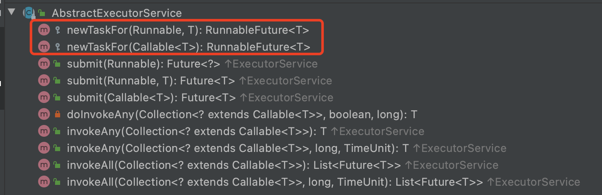
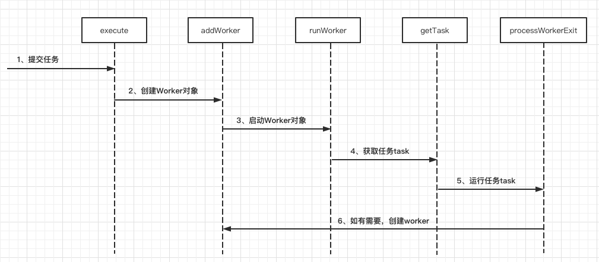
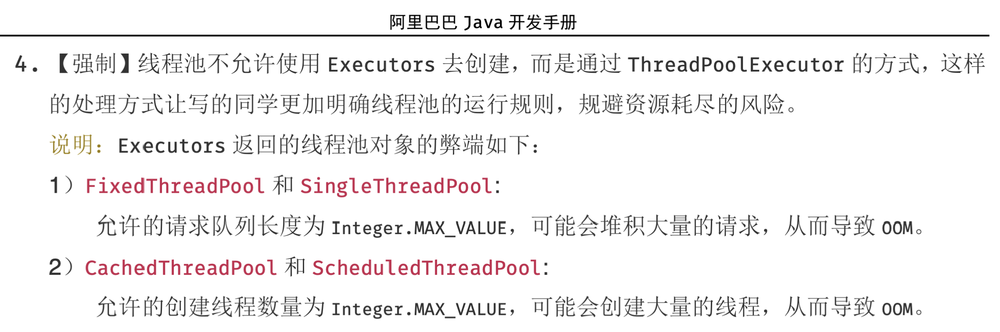

##   ThreadPoolExecutor源码解析

## 0摘要

>   并发处理的广泛应用是Amdahl定律代摩尔定律成为计算机性能发展源动力的根本原因，也是人类压榨计算机运算能力的最有力武器。
>
>   在实际使用中，一定情况下，使用多线程确实可以提高性能，但是无休止的创建线程，往往会导致系统资源吃紧，乃至OOM。
>
>   如果并发请求过于频繁，且任务相对简单，线程的创建和销毁占用的时间远远大于执行的时间，如此一来将大大降低整个系统的效率。
>
>   针对这个问题，如果复用已创建的线程，将会解决上述问题，并且当任务到达时，无需等待线程创建即可立即执行，提高响应速度。
>
>   Java的JUC并发包中ThreadPoolExecutor提供对线程池的统一管理和任务分配！
>
>   为了更好的使用线程池，以及针对特定的业务进行调优，有必要深入了解线程池的实现原理和思想。


## 1 线程池的继承关系

>   Java中的线程池实现类是ThreadPoolExecutor。
>
>   顶层接口是Executor，第2层接口是ExecutorService，第3层接口是AbstractExecutorService，被ThreadPooleExecutor直接继承。


### 1.1 Executor接口

>   Executor接口只有一个execute方法，具体实现在子类中按照各自的需求定义，使用的时候只需传入一个Runnable的实现类即可，无需关注其他东西，非常简洁！

```java
public interface Executor {
    void execute(Runnable command);
}
```


### 1.2 ExecutorService接口

>   继承自Executor接口，提供了管理终止的方法、生成Future跟踪一个或多个异步任务执行进度的方法的声明。
>
>   主要声明方法有：shutDown()，shutDownNow()，invokeAll()，invokeAny()和submit()等方法。
>
>   如果需要支持即时关闭，也就是shutDownNow()方法，则任务需要正确处理中断。


### 1.3 AbstractExecutorService抽象类

>   实现了ExecutorService中声明的一些方法，并在这里添加了自己的两个方法（newTaskFor，重载）
>
>   Returns a {@code RunnableFuture} for the given runnable and default value.
>
>   Returns a {@code RunnableFuture} for the given callable task.




## 2 ThreadPoolExecutor整体分析

### 2.1 ctl字段几相关函数说明

>   原子类型的ctl作为线程池的运行状态的控制记录字段，作为线程池我们一方面要记录线程池的运行状态，另一方面还要记录线程池中线程的个数，作者想着把两种记录状态融合在了一个变量ctl中，将32位的ctl高3位用于线程池状态的记录（因为只定义了5种状态，3位完全够用），剩下的低29位用于线程个数的记录，可记录的线程最大个数为2^29 - 1，约为5.3亿。如果后续源码需要扩展，可以将ctl定义为AtomicLong。
>
>   因为AtomicInteger是有符号整数，所以-1的二进制表示形式是32个1（补码表示），左移29为就是高3位是1，其余位为0：
>
>   11111111111111111111111111111111
>
>   11100000000000000000000000000000
>
>   作者把上述这个状态定义为RUNNING状态，这样在后续的分析中，只要判断ctl < 0即可表明线程池处于运行状态（运行也是线程池的主要状态）

```java
private final AtomicInteger ctl = new AtomicInteger(ctlOf(RUNNING, 0));
private static final int COUNT_BITS = Integer.SIZE - 3;
private static final int CAPACITY   = (1 << COUNT_BITS) - 1;

// runState is stored in the high-order bits
private static final int RUNNING    = -1 << COUNT_BITS;
private static final int SHUTDOWN   =  0 << COUNT_BITS;
private static final int STOP       =  1 << COUNT_BITS;
private static final int TIDYING    =  2 << COUNT_BITS;
private static final int TERMINATED =  3 << COUNT_BITS;

// Packing and unpacking ctl
private static int runStateOf(int c)     { return c & ~CAPACITY; }
private static int workerCountOf(int c)  { return c & CAPACITY; }
private static int ctlOf(int rs, int wc) { return rs | wc; }
```


>   **线程池的状态（5种）**

| 运行状态（rs）   | 状态描述                                                     |
| :--------------- | ------------------------------------------------------------ |
| **`RUNNING`**    | 能接受新提交的任务，并且也能处理阻塞队列中的任务；           |
| **`SHUTDOWN`**   | 关闭状态，不再接受新提交的任务，但却可以继续处理阻塞队列中已保存的任务； |
| **`STOP`**       | 不能接受新任务，也不处理队列中的任务，会中断正在处理任务的线程； |
| **`TIDYING`**    | 如果所有的任务都已终止了，workerCount (有效线程数) 为0；     |
| **`TERMINATED`** | 在terminated() 方法执行完后进入该状态，默认terminated()方法中什么也没有做。 |

进入TERMINATED的条件如下：

*   线程池不是RUNNING状态；
*   线程池状态不是TIDYING状态或TERMINATED状态；
*   如果线程池状态是SHUTDOWN并且workerQueue为空；
*   workerCount为0；
*   设置TIDYING状态成功。


下图为线程池的状态转换过程：


==注意：SHUTDOWN状态调用shutdownNow()也可到达STOP状态！==


>   demo

```java
package com.ly.test;

/**
 * liyang 2020-11-17
 * 测试整型-1在计算中的二进制表示形式
 * 
 * 结果：
 * 11111111111111111111111111111111
 * 11100000000000000000000000000000
 *
 * Process finished with exit code 0
 */

public class TestMinusOne {
    public static void main(String[] args) {
        final int MINUS_ONE = -1;
        System.out.println(Integer.toBinaryString(MINUS_ONE));

        final int COUNT_BITS = Integer.SIZE - 3;
        final int RUNNING = MINUS_ONE << COUNT_BITS;
        System.out.println(Integer.toBinaryString(RUNNING));
    }
}
```


### 2.2 线程池的构造

>   有4个重载构造器，最多有7个参数，前5个参数必填，后两个参数可以选填，不填就是默认的线程工厂和默认拒绝策略

```java
public ThreadPoolExecutor(int corePoolSize,
                          int maximumPoolSize,
                          long keepAliveTime,
                          TimeUnit unit,
                          BlockingQueue<Runnable> workQueue,
                          ThreadFactory threadFactory,
                          RejectedExecutionHandler handler) {
    ...
}
```


#### 2.2.1 corePoolSize

>   核心线程池大小，当有新任务在execute()方法提交时，会执行以下判断：如果运行的线程少于corePoolSize，则创建新核心线程来处理任务，即使线程池中的其他线程是空闲的；


#### 2.2.2 maximumPoolSize

>   线程池最大容量大小，当提交任务的时候，线程数已经大于corePoolSize的时候，并且阻塞队列已经满的时候，此时线程数小于maximumPoolSize，此时会创建新的非核心线程来处理任务。

==注意：核心线程与非核心线程仅仅是在创建的时候用作概念上的区分，实际在线程池中的使用方式完全一致，在回收的时候不作区分！==


#### 2.2.3 keepAliveTime

>   线程池维护线程所允许的空闲时间。当线程池中的线程数量大于corePoolSize的时候，如果这时没有新的任务提交，核心线程外的线程不会立即销毁，而是会等待，直到等待的时间超过了keepAliveTime才进行回收。


#### 2.2.4 unit

>   时间单位：TimeUnit.SECONDS


#### 2.2.5 threadFactory

>   默认使用Executors.defaultThreadfactory()，创建出来的线程都在同一个线程组，拥有同样的NORM_PRIORITY优先级并且都不是守护线程。
>
>   如果自己指定ThreadFactory，那么就可以改变线程名、线程组、优先级、是否是守护线程等。
>
>   一般采用默认即可！


#### 2.2.6 workQueue

>   传入BlockingQueue<Runnable>的实现类，勇于任务队列的缓存

主要实现类有：

1.  **直接切换**：这种方式常用的队列是SynchronousQueue，直接交付，不能存储元素， 每个put()都必须等到一个take()，才能解除阻塞，反之亦然。（==在Executors.newCachedThreadPool()作为阻塞对列使用==）
2.  **无界队列**：一般使用基于链表的阻塞队列LinkedBlockingQueue。如果使用这种方式，那么线程池中能够创建的最大线程数就是corePoolSize，而maximumPoolSize不会起作用，因为基于链表实现的阻塞队列是不在“满”的，理论上无穷大。
3.  **有界队列**：一般使用ArrayBlockingQueue。使用该方式可以将线程池的最大线程数量限制为maximumPoolSize，这样能够降低资源的消耗，但同时这种方式也使得线程池对线程的调度变得更困难，因为线程池和队列的容量都是有限的值，所以要想使线程池处理任务的吞吐率达到一个相对合理的范围，又想使线程调度相对简单，并且还要尽可能的降低线程池对资源的消耗，就需要合理的设置这两个数量。


#### 2.2.7 RejectedExecutionHandler

>   线程拒绝策略，默认是AbortPolicy

| 策略                | 描述                                               |
| ------------------- | -------------------------------------------------- |
| AbortPolicy         | 丢弃任务并抛出异常，这是默认策略；                 |
| CallerRunsPolicy    | 调用者所在的线程来执行任务；                       |
| DiscardOldestPolicy | 丢弃阻塞队列中靠最前的任务，然后重新提交当前任务； |
| DiscardPolicy       | 直接丢弃任务，但不抛出异常。                       |


## 3 线程池的任务调度机制

### 3.1 executor方法

>   当传入一个实现Runnable的task的时候，会根据ctl的状态采用具体的执行策略！

```java
public void execute(Runnable command) {
    if (command == null)
        throw new NullPointerException();
    int c = ctl.get();
    // 如果当前线程数小于核心线程数的大小，使用addWorker创建一个Worker线程
    if (workerCountOf(c) < corePoolSize) {
        // 传入的command作为addWorker的firstTask，true表示是核心线程，仅用作创建时标记
        // 核心线程在addWorker中标记为核心线程的和corePoolSize做比较，否则和maximumPoolSize做比较
        if (addWorker(command, true))
            return;
        c = ctl.get();
    }
    // 大于等于corePoolSize，线程池运行情况下，尝试将任务放入阻塞队列
    if (isRunning(c) && workQueue.offer(command)) {
        int recheck = ctl.get();
        // 如果此时发现线程池不是运行状态，将任务移除，因为这种情况拒绝新的任务
        if (! isRunning(recheck) && remove(command))
            reject(command);
        // 如果RUNNING状态发现线程数为0，立马创建一个没有firstTask的非核心线程
        else if (workerCountOf(recheck) == 0)
            addWorker(null, false);
    }
    // 大于等于corePoolSize，且阻塞队列任务已满，看能否创建小于等于maximumPoolSize的非核心线程
    // 创建失败则根据拒绝策略拒绝任务
    else if (!addWorker(command, false))
        reject(command);
}
```


### 3.2 addWorker方法

>   addWorker方法的主要工作是在线程池中创建一个新的线程并执行，firstTask参数 用于指定新增的线程执行的第一个任务，core参数为true表示在新增线程时会判断当前活动线程数是否少于corePoolSize，false表示新增线程前需要判断当前活动线程数是否少于maximumPoolSize，源码如下：

```java
private boolean addWorker(Runnable firstTask, boolean core) {
    retry:
    for (;;) { // 自旋
        int c = ctl.get();
        int rs = runStateOf(c);

        // 这个写法看着晕！转换一下！
        // if ( rs >= SHUTDOWN && ( rs != SHUTDOWN || firstTask != null || workQueue.isEmpty() ) ) 
        // 当rs >= SHUTDOWN时
        //    1、如果 rs != SHUTDOW，也就是STOP，TIDYING，TERMINATED，一定不会创建新的线程，返回false；
        //    2、如果 rs == SHUTDOWN，但是firstTask不为空，因为这种情况不接收新任务，返回false；
        //    3、如果 rs == SHUTDOWN，workQueue已经空了，也不会创建新的线程        （fixme：`process`）
        if (rs >= SHUTDOWN &&
            ! (rs == SHUTDOWN &&
               firstTask == null &&
               ! workQueue.isEmpty()))
            return false;
        // 自旋
        for (;;) {
            int wc = workerCountOf(c);
            // 判断线程数是否超过容量，core为true判断是否超过核心线程数，为false判断是否超过最大线程数
            // 只要一个满足，说明无法创建，返回false
            if (wc >= CAPACITY ||
                wc >= (core ? corePoolSize : maximumPoolSize))
                return false;
            // 尝试使用cas增加线程的个数，增加成功，跳出retry标签，否则不断自旋直到成功
            if (compareAndIncrementWorkerCount(c))
                break retry;
            c = ctl.get();  // Re-read ctl
            // 如果当前的运行状态不等于rs，说明状态已被改变，返回第一个for循环继续执行
            if (runStateOf(c) != rs)
                continue retry;
            // else CAS failed due to workerCount change; retry inner loop
        }
    }

    boolean workerStarted = false;
    boolean workerAdded = false;
    Worker w = null;
    try {
        // 使用firstTask来创建一个Worker线程，firstTask可以为null
        w = new Worker(firstTask);
        // 注意Worker中会使用线程工厂创建一个thread
        final Thread t = w.thread;
        if (t != null) {
            final ReentrantLock mainLock = this.mainLock;
            mainLock.lock();
            try {
                // Recheck while holding lock.
                // Back out on ThreadFactory failure or if
                // shut down before lock acquired.
                int rs = runStateOf(ctl.get());

                // rs < SHUTDOWN，即当前处于RUNNNING状态
                // 或者rs == SHUTDOWN && firstTask == null，那创建一个工作线程
                // 因为在SHUTDOWN时不会在添加新的任务，但还是会执行workQueue中的任务
                if (rs < SHUTDOWN ||
                    (rs == SHUTDOWN && firstTask == null)) {
                    if (t.isAlive()) // precheck that t is startable
                        throw new IllegalThreadStateException();
                    workers.add(w); // workers是线程池中的私有HashSet<Worker>
                    int s = workers.size();
                    if (s > largestPoolSize) // largestPoolSize用于记录线程池中同时存活的最大线程数
                        largestPoolSize = s;
                    workerAdded = true;
                }
            } finally {
                mainLock.unlock();
            }
            if (workerAdded) {
                t.start(); // 线程创建并完成一些记录操作后启动线程，调用worker中的run方法
                workerStarted = true;
            }
        }
    } finally {
        if (! workerStarted)
            addWorkerFailed(w);
    }
    return workerStarted;
}
```


>   ThreadPoolExecutor内部类Worker类实现了Runnable接口，Worker构造器使用线程工厂创建线程的时候，this作为Runnable实现类的接口传入，因此thread.start会调用Worker类重写的run()方法！
>
>   Worker作为线程池的内部类，线程池中线程被Worker包装起来进行维护！

```java
private final class Worker
        extends AbstractQueuedSynchronizer
        implements Runnable {...}
```

```java
Worker(Runnable firstTask) {
    setState(-1); // inhibit interrupts until runWorker
    this.firstTask = firstTask;
    this.thread = getThreadFactory().newThread(this);
}
```

```java
public void run() {
    runWorker(this);
}
```


**扩展：Worker源码**

>   Worker继承了AQS，AQS是一种抽象的队列同步器，定义了一套访问共享资源的同步器框架!
>
>   常见的同步类ReentrantLock/Semaphore/CountDownLatch都依赖于它！
>
>   对于资源如何被各个线程调用，轮到谁执行，我们不用管，AQS已经帮我们搞定了，我们在使用的时候根据需要主要定义共享资源state的获取与释放方式即可！
>
>   -   isHeldExclusively()：该线程是否正在独占资源。只有用到condition才需要去实现它。
>   -   tryAcquire(int)：独占方式。尝试获取资源，成功则返回true，失败则返回false。
>   -   tryRelease(int)：独占方式。尝试释放资源，成功则返回true，失败则返回false。
>   -   tryAcquireShared(int)：共享方式。尝试获取资源。负数表示失败；0表示成功，但没有剩余可用资源；正数表示成功，且有剩余资源。
>   -   tryReleaseShared(int)：共享方式。尝试释放资源，如果释放后允许唤醒后续等待结点返回true，否则返回false。
>
>   以上函数成对实现即可，因为以上函数并不是接口函数，因此不需要的我们不需要空实现，据网上讨论，作者采用这种写法，是站在工程的角度，为了避免出现大量的重复空实现。
>
>   
>
>   AQS的线程管理机制是双向链表实现的队列，并且提供两种竞争方式：
>
>   *   公平竞争：新创建的线程加到对列尾部，严格FIFO
>   *   非公平竞争：队列中的线程严格FIFO，但是新创建的线程，还没加到队列尾的时候，这个时候当前面的线程释放资源的时候，会唤醒队列首部的线程，在唤醒的时候，这个时候新创建线程极大可能在队首线程唤醒前抢到锁（共享资源），因此cpu利用率更高，但可能会造成队首的线程饥饿，比如在ReentrantReadWriterLock中，为了避免写线程饥饿，当写线程处于队首的时候，即使采用非公平竞争，也不允许后续读线程插队，而写锁可以随时插队！
>
>   对于AQS框架，后续有时间写一篇博客总结下，对于理解JUC中大部分api大有裨益。

```java
private final class Worker
    extends AbstractQueuedSynchronizer
    implements Runnable
{
    /**
         * This class will never be serialized, but we provide a
         * serialVersionUID to suppress a javac warning.
         */
    private static final long serialVersionUID = 6138294804551838833L;

    /** Thread this worker is running in.  Null if factory fails. */
    final Thread thread;
    /** Initial task to run.  Possibly null. */
    Runnable firstTask;
    /** Per-thread task counter */
    volatile long completedTasks;

    /**
         * Creates with given first task and thread from ThreadFactory.
         * @param firstTask the first task (null if none)
         */
    Worker(Runnable firstTask) {
        setState(-1); // inhibit interrupts until runWorker
        this.firstTask = firstTask;
        this.thread = getThreadFactory().newThread(this);
    }

    /** Delegates main run loop to outer runWorker  */
    public void run() {
        runWorker(this);
    }

    // Lock methods
    //
    // The value 0 represents the unlocked state.
    // The value 1 represents the locked state.

    protected boolean isHeldExclusively() {
        return getState() != 0;
    }

    protected boolean tryAcquire(int unused) {
        if (compareAndSetState(0, 1)) {
            setExclusiveOwnerThread(Thread.currentThread());
            return true;
        }
        return false;
    }

    protected boolean tryRelease(int unused) {
        setExclusiveOwnerThread(null);
        setState(0);
        return true;
    }

    public void lock()        { acquire(1); }
    public boolean tryLock()  { return tryAcquire(1); }
    public void unlock()      { release(1); }
    public boolean isLocked() { return isHeldExclusively(); }

    void interruptIfStarted() {
        Thread t;
        if (getState() >= 0 && (t = thread) != null && !t.isInterrupted()) {
            try {
                t.interrupt();
            } catch (SecurityException ignore) {
            }
        }
    }
}
```


### 3.3 runWorker方法

>   该方法负责具体的task任务的执行，因此线程池的设计将创建线程和线程执行任务两部分分离，避免耦合！

```java
final void runWorker(Worker w) {
    Thread wt = Thread.currentThread();
    Runnable task = w.firstTask;
    w.firstTask = null;
    // 首先解锁一次，允许中断，因为AQS中默认的state是0，如果刚创建了一个Worker对象，还没有执行任务时，这时就不应该被中断
    // 因此创建的时候state被设置为了-1，见Worker的构造器和tryAcquire()
    w.unlock(); // allow interrupts
    boolean completedAbruptly = true;
    try {
        // task不为空 或者 task = getTask() 不为空，继续执行
        while (task != null || (task = getTask()) != null) {
            // 加锁，作用就是通过阻塞方式直到拿到锁，拿到锁之后，在shutdown函数调用的时候就不能把它标记为空闲线程（Worker继承AQS框架实现独占锁）
            // 也就是加锁之后一定是有任务的，并且不可被中断，这也符合SHTUTSDOWN状态的描述
            w.lock();
            // If pool is stopping, ensure thread is interrupted;
            // if not, ensure thread is not interrupted.  This
            // requires a recheck in second case to deal with
            // shutdownNow race while clearing interrupt
            
            // 如果线程池处于STOP状态，一定保证wt是中断状态，这里这么判断是为了判断完runState后，
            // 线程池调用shutdownNow触发中断，并进入STOP状态。
            if ((runStateAtLeast(ctl.get(), STOP) ||
                 (Thread.interrupted() && // 判断中断后会清除中断标记位
                  runStateAtLeast(ctl.get(), STOP))) &&
                !wt.isInterrupted()) // 判断中断后不会清除中断标记位
                wt.interrupt(); // 会调用interrupt0(); Just to set the interrupt flag
            try {
                // 线程开始执行之前执行此方法，可以实现一些特殊功能，比如暂停/恢复，默认空实现
                beforeExecute(wt, task);
                Throwable thrown = null;
                try {
                    // 任务线程的执行，相当于在本线程调用task的普通run()方法
                    // 使用start()相当于另开线程，也就是子线程中创建一个子线程
                    task.run();
                } catch (RuntimeException x) {
                    thrown = x; throw x;
                } catch (Error x) {
                    thrown = x; throw x;
                } catch (Throwable x) {
                    thrown = x; throw new Error(x);
                } finally {
                    // 线程开始执行之前执行此方法，可以实现一些特殊功能，比如异常日志收集，默认空实现
                    afterExecute(task, thrown);
                }
            } finally {
                task = null; // 任务执行完，置为null：1、避免任务重复执行 2、help GC
                w.completedTasks++;
                w.unlock();
            }
        }
        completedAbruptly = false;
    } finally {
        // 线程执行完（取不到新的非null任务）或异常结束后执行此函数
        processWorkerExit(w, completedAbruptly);
    }
}
```


### [demo演示]

>   demo：使用钩子函数实现暂停/恢复

```java
package com.ly.thread;

import java.util.concurrent.*;
import java.util.concurrent.locks.Condition;
import java.util.concurrent.locks.ReentrantLock;

/**
 * liyang 2020-11-30
 * 利用beforeExecute实现可暂停/继续的线程池
 *
 * 结果：
 * ...
 * hello world
 * hello world
 * hello world
 * 线程池被暂停了
 * 线程池继续执行
 * hello world
 * hello world
 * hello world
 * ...
 *
 * Process finished with exit code 0
 */
public class TestSuspendableThreadPool extends ThreadPoolExecutor {
    // 构造器
    public TestSuspendableThreadPool(int corePoolSize,
                                     int maximumPoolSize,
                                     long keepAliveTime,
                                     TimeUnit unit,
                                     BlockingQueue<Runnable> workQueue) {
        super(corePoolSize, maximumPoolSize, keepAliveTime, unit, workQueue);
    }

    public TestSuspendableThreadPool(int corePoolSize,
                                     int maximumPoolSize,
                                     long keepAliveTime, TimeUnit unit,
                                     BlockingQueue<Runnable> workQueue,
                                     ThreadFactory threadFactory) {
        super(corePoolSize, maximumPoolSize, keepAliveTime, unit, workQueue, threadFactory);
    }

    public TestSuspendableThreadPool(int corePoolSize,
                                     int maximumPoolSize,
                                     long keepAliveTime,
                                     TimeUnit unit,
                                     BlockingQueue<Runnable> workQueue,
                                     RejectedExecutionHandler handler) {
        super(corePoolSize, maximumPoolSize, keepAliveTime, unit, workQueue, handler);
    }

    public TestSuspendableThreadPool(int corePoolSize,
                                     int maximumPoolSize,
                                     long keepAliveTime,
                                     TimeUnit unit,
                                     BlockingQueue<Runnable> workQueue,
                                     ThreadFactory threadFactory,
                                     RejectedExecutionHandler handler) {
        super(corePoolSize, maximumPoolSize, keepAliveTime, unit, workQueue, threadFactory, handler);
    }


    private boolean isPaused;
    private final ReentrantLock pauseLock = new ReentrantLock();
    private final Condition unpaused = pauseLock.newCondition();

    protected void beforeExecute(Thread t, Runnable r) {
        super.beforeExecute(t, r);
        pauseLock.lock();
        try {
            while (isPaused) unpaused.await(); // 等待直到信号来，或者中断来
        } catch (InterruptedException ie) {
            t.interrupt();
        } finally {
            pauseLock.unlock();
        }
    }

    public void pause() {
        pauseLock.lock();
        try {
            isPaused = true;
        } finally {
            pauseLock.unlock();
        }
    }

    public void resume() {
        pauseLock.lock();
        try {
            isPaused = false;
            unpaused.signalAll();
        } finally {
            pauseLock.unlock();
        }
    }


    public static void main(String[] args) throws InterruptedException {
        TestSuspendableThreadPool suspendableThreadPool = new TestSuspendableThreadPool(1,
                5,
                3,
                TimeUnit.SECONDS,
                new LinkedBlockingQueue<>(),
                Executors.defaultThreadFactory(),
                new ThreadPoolExecutor.DiscardOldestPolicy());

        Runnable task = new Runnable() {
            @Override
            public void run() {
                System.out.println("hello world");
            }
        };

        for (int i = 0; i < 10000; i++) {
            suspendableThreadPool.execute(task);
        }

        suspendableThreadPool.pause();
        System.out.println("线程池被暂停了");
        Thread.sleep(1000);
        suspendableThreadPool.resume();
        System.out.println("线程池继续执行");

        suspendableThreadPool.shutdown();
    }

}
```


### 3.4 getTask方法

>   getTask方法用来从阻塞队列中取任务，代码如下：

```java
private Runnable getTask() {
    boolean timedOut = false; // Did the last poll() time out?

    for (;;) { // 自旋
        int c = ctl.get();
        int rs = runStateOf(c);

        // Check if queue empty only if necessary.
        // 线程池非RUNNING状态
        // 如果线程状态为STOP或阻塞队列为空，线程数减1（decrementWorkerCount()通过自旋转cas确保成功减1）
        if (rs >= SHUTDOWN && (rs >= STOP || workQueue.isEmpty())) {
            decrementWorkerCount();
            return null; // 返回null，表示无法获取到新的任务
        }

        int wc = workerCountOf(c);

        // Are workers subject to culling?
        // 是否允许超时回收线程，allowCoreThreadTimeOut 为 true 或者 线程数大雨核心线程数
        boolean timed = allowCoreThreadTimeOut || wc > corePoolSize;

        // 1、线程数大于最大线程数或者在于许超时回收线程的情况下出现超时
        // 2、线程数大于1或者阻塞队列为空
        // 满足以上2个条件，线程数cas减1，失败会通过continu进而自旋重试
        if ((wc > maximumPoolSize || (timed && timedOut))
            && (wc > 1 || workQueue.isEmpty())) {
            if (compareAndDecrementWorkerCount(c))
                return null;
            continue;
        }

        try {
            // timed为true，采用poll定时去阻塞队列取元素，超时没取到返回null
            // false，采用take方法去阻塞队列取元素，取不到则阻塞，直到有元素或者被中断，中断后直接抬到catch块
            Runnable r = timed ?
                workQueue.poll(keepAliveTime, TimeUnit.NANOSECONDS) :
            workQueue.take(); // 被中断退出后，下一个循环队列为空，返回null任务
            if (r != null) // 有不空的任务，直接返回
                return r;
            timedOut = true; // r = null，已经超时，没有直接返回null，下次循环会决定线程数是否减1并返回null
        } catch (InterruptedException retry) {
            timedOut = false;
        }
    }
}
```


### 3.5 processWorkerExit方法

>   当前线程获取不到任务或发生异常的时候，会执行此方法！

```java
private void processWorkerExit(Worker w, boolean completedAbruptly) {
    // 如果completedAbruptly值为true，则说明线程执行时出现了异常，需要将workerCount减1；
    // 如果线程执行时没有出现异常，说明在getTask()方法中已经已经对workerCount进行了减1操作，这里就不必再减了。 
    if (completedAbruptly) // If abrupt, then workerCount wasn't adjusted
        decrementWorkerCount();

    final ReentrantLock mainLock = this.mainLock;
    mainLock.lock();
    try {
        completedTaskCount += w.completedTasks;
        // w已经执行完了任务，将其移除出去，下一次gc会回收
        workers.remove(w);
    } finally {
        mainLock.unlock();
    }
	// 根据线程池状态进行判断是否结束线程池
    tryTerminate();

    int c = ctl.get();
    // 如果线程池不是STOP状态
    // 1、如果worker线程是正常结束，记录下需要保持的最小线程数min，如有min为0且阻塞队列不空，将min设置为1
    // 2、如果worker线程是异常结束，重新创建一个firstTask == null，标记为非核心线程的线程补上
    if (runStateLessThan(c, STOP)) {
        if (!completedAbruptly) {
            int min = allowCoreThreadTimeOut ? 0 : corePoolSize;
            if (min == 0 && ! workQueue.isEmpty())
                min = 1;
            if (workerCountOf(c) >= min)
                return; // replacement not needed
        }
        addWorker(null, false); // 创建线程，直到workerCountOf(c) >= min
    }
}
```


### 3.6 tryTerminate()方法

>   tryTerminate方法根据线程池状态进行判断是否结束线程池，源码如下！

```java
final void tryTerminate() {
    for (;;) { // 自旋
        int c = ctl.get();
        // 线程池正在运行，直接返回；
        // 线程池处于TIDYING或TERMINATED，直接返回；
        // 线程池处于SHUTDOWN状态，但是阻塞队列不空，直接返回。
        if (isRunning(c) ||
            runStateAtLeast(c, TIDYING) ||
            (runStateOf(c) == SHUTDOWN && ! workQueue.isEmpty()))
            return;
        // 以上没有返回，并且线程数不为0，中断回收一个空闲的工作线程
        // 走到这一步说明线程池已经不在运行，阻塞队列已经没有任务，但是还要回收正在工作的Worker
        if (workerCountOf(c) != 0) { // Eligible to terminate
            interruptIdleWorkers(ONLY_ONE);
            return;
        }

        // 走到这里说明worker已经全部回收了，并且线程池已经不在运行，阻塞队列已经没有任务，可以准备结束线程池了
        final ReentrantLock mainLock = this.mainLock;
        mainLock.lock();
        try {
            // 这里尝试设置状态为TIDYING，如果设置成功，则调用terminated方法
            if (ctl.compareAndSet(c, ctlOf(TIDYING, 0))) {
                try {
                    // terminated方法默认是空实现，可能作者是为了以后的扩展
                    terminated();
                } finally {
                    ctl.set(ctlOf(TERMINATED, 0)); // terminated方法调用完毕之后，状态变为TERMINATED
                    termination.signalAll(); // condition条件
                }
                return;
            }
        } finally {
            mainLock.unlock();
        }
        // else retry on failed CAS
    }
}
```


线程池运行时的主要流程如下：



至此，线程池的主要工作流程介绍完毕！


**以下介绍更改线程池运行状态的函数和介绍非运行状态下如何回收线程**

### 3.7 shutdown方法

>   执行此方法，线程进入SHUTDOWN状态

```java
public void shutdown() {
    final ReentrantLock mainLock = this.mainLock;
    mainLock.lock();
    try {
        // 安全策略判断
        checkShutdownAccess();
        // 自旋cas确保切换状态为SHUTDOWN
        advanceRunState(SHUTDOWN);
        // 中断所有空闲的线程
        interruptIdleWorkers();
        onShutdown(); // hook for ScheduledThreadPoolExecutor
    } finally {
        mainLock.unlock();
    }
    // 尝试结束线程池
    tryTerminate();
}
```


### 3.8 interruptIdleWorkers方法

>   该方法具体使用什么方法来判断线程空闲与否的？以及为什么可以这么做？
>
>   使用tryLock方法来判断线程池中的线程是否是空闲状态，如果线程是空闲状态则设置中断标记，因为Worker继承AQS实现独占锁；
>
>   当worker执行任务的时候会加锁，也就是处于运行状态，这时候你取tryLock是拿不锁的，也就是不可中断；
>
>   如果能拿到锁，说明线程么没有处于运行状态，那么tryLock之后，标记一下中断。
>
>   
>
>   那在标记完中断标志位之后是如何回收worker线程的？
>
>   在worker线程执行w.lock()之前，有一个getTask()函数，如果直接返回null，直接进入finally，会被processWorkerExit进行线程回收；
>
>   如果getTask()进入到try块，在没有回收线程情况下，当队列没有元素，当前线程t使用take取元素的时候会不断的阻塞，前文tryLock会给t一个中断，进而take会跳出阻塞，进入下一次循环（自选），因为这时候线程池状态已经变了，取不到任务的时候直接返回null，然后就是执行上一句对应的操作，实现线程回收！
>
>   
>
>   注意：在processWorkerExit中我们仅仅使用remove将线程一处hashset，jvm的垃圾回收机制会在下一次gc时回收这个垃圾。

```java
private void interruptIdleWorkers() {
    interruptIdleWorkers(false);
}
```

```java
private void interruptIdleWorkers(boolean onlyOne) {
    final ReentrantLock mainLock = this.mainLock;
    mainLock.lock();
    try {
        for (Worker w : workers) {
            Thread t = w.thread;
            if (!t.isInterrupted() && w.tryLock()) { // work中继承AQS重写lock实现了独占锁，这里使用tryLock尝试获取锁
                try {
                    t.interrupt();
                } catch (SecurityException ignore) {
                } finally {
                    w.unlock();
                }
            }
            if (onlyOne)
                break;
        }
    } finally {
        mainLock.unlock();
    }
}
```

```java
public boolean tryLock()  { return tryAcquire(1); }

protected boolean tryAcquire(int unused) {
    if (compareAndSetState(0, 1)) {
        setExclusiveOwnerThread(Thread.currentThread());
        return true;
    }
    return false;
}
```


### [demo演示]

>    测试阻塞可被中断

```java
package com.ly.test;

/**
 * liyang 2020-11-30
 * 当阻塞队列为空，使用take取元素会被阻塞
 * 需要外部中断跳出阻塞，直接进入finally并执行后续操作
 *
 *
 * 1、注释thread.interrupt();
 * 结果：
 * 当前子线程被阻塞
 *
 * 2、开启thread.interrupt();
 * 结果：
 * 当前子线程被阻塞
 * 中断消除阻塞
 * 跳出try块
 * 子线程正常执行完毕，主线程执行且正常结束！
 *
 * Process finished with exit code 0
 */

import java.util.concurrent.LinkedBlockingQueue;

public class TestInterrupt {
    public static void main(String[] args) throws InterruptedException {
        Thread thread = new Thread(new Runnable() {
            @Override
            public void run() {
                LinkedBlockingQueue<String> queue = new LinkedBlockingQueue<>();
                try {
                    System.out.println("当前子线程被阻塞");
                    String e =  queue.take();
                    System.out.println("这一句会被执行吗？"); // 阻塞被中断后不会执行这一句
                } catch (InterruptedException retry) {
                    System.out.println("中断消除阻塞");
                }
                System.out.println("跳出try块");
            }
        });
        thread.start();

        thread.interrupt(); // 给子线程一个中断

        thread.join();
        System.out.println("子线程正常执行完毕，主线程执行且正常结束！");
    }
}
```


>   测试线程池中断后可继续执行任务，但是重新提交任务会使用拒绝策略

```java
package com.ly.test;

import java.util.concurrent.Executors;
import java.util.concurrent.LinkedBlockingQueue;
import java.util.concurrent.ThreadPoolExecutor;
import java.util.concurrent.TimeUnit;
import java.util.concurrent.atomic.AtomicInteger;

/**
 * liyang 2020-12-01
 * 测试shutdown，和模拟shutdown之后提交任务，复现被决绝情况
 *
 * 结果：
 * ...
 * pool-1-thread-2: 3
 * pool-1-thread-8: 1
 * 线程池是否shutdown了：false
 * pool-1-thread-10: 0
 * pool-1-thread-5: 8
 * 线程池是否shutdown了：true
 * 线程池是否terminated了：false
 * Exception in thread "main" java.util.concurrent.RejectedExecutionException: 
 * Task com.ly.test.ShutdownTask@4dc63996 rejected from java.util.concurrent.ThreadPoolExecutor@d716361
 * [Shutting down, pool size = 10, active threads = 10, queued tasks = 80, completed tasks = 10]
 * 	at java.util.concurrent.ThreadPoolExecutor$AbortPolicy.rejectedExecution(ThreadPoolExecutor.java:2063)
 * 	at java.util.concurrent.ThreadPoolExecutor.reject(ThreadPoolExecutor.java:830)
 * 	at java.util.concurrent.ThreadPoolExecutor.execute(ThreadPoolExecutor.java:1379)
 * 	at com.ly.test.TestShutdown.main(TestShutdown.java:57)
 * pool-1-thread-1: 10
 * pool-1-thread-8: 16
 * ...
 * pool-1-thread-9: 99
 * pool-1-thread-3: 98
 *
 * Process finished with exit code 1
 */
public class TestShutdown {
    public static void main(String[] args) throws InterruptedException {
        ThreadPoolExecutor threadPool = new ThreadPoolExecutor(10,
                10,
                0,
                TimeUnit.SECONDS,
                new LinkedBlockingQueue<>(),
                Executors.defaultThreadFactory(),
                new ThreadPoolExecutor.AbortPolicy()); // AbortPolicy：默认拒绝策略，不填也是这个

        for (int i = 0; i < 100; i++) {
            threadPool.execute(new ShutdownTask());
        }

        Thread.sleep(500);
        System.out.println("线程池是否shutdown了：" + threadPool.isShutdown()); // false
        // shutdown之后继续执行正在执行的和已经提交在阻塞队列中的任务
        threadPool.shutdown();
        System.out.println("线程池是否shutdown了：" + threadPool.isShutdown()); // true
        System.out.println("线程池是否terminated了：" + threadPool.isTerminated()); // false

        // 此时线程池已经是SHUTDOWN状态了，我继续提交一个任务，默认拒绝策略下抛出异常
        threadPool.execute(new ShutdownTask()); // RejectedExecutionException
    }
}

class ShutdownTask implements Runnable {
    private static final AtomicInteger ai = new AtomicInteger(0);
    @Override
    public void run() {
        try {
            Thread.sleep(500);
            System.out.println(Thread.currentThread().getName() + ": " + ai.getAndIncrement());
        } catch (InterruptedException e) {
            e.printStackTrace();
        }
    }
}
```


### 3.9 shutdownNow方法

>   Attempts to stop all actively executing tasks, halts the processing of waiting tasks, and returns a list of the tasks that were awaiting execution. 
>
>   These tasks are drained (removed) from the task queue upon return from this method.

```java
public List<Runnable> shutdownNow() {
    List<Runnable> tasks;
    final ReentrantLock mainLock = this.mainLock;
    mainLock.lock();
    try {
        checkShutdownAccess();
        // 线程池状态直接置为STOP
        advanceRunState(STOP);
        // 中断所有工作线程，无论是否空闲
        interruptWorkers();
        // 取出队列中没有被执行的任务
        tasks = drainQueue();
    } finally {
        mainLock.unlock();
    }
    tryTerminate();
    return tasks;
}
```


### [demo演示]

>   使用shutdownNow停止-01

```java
package com.ly.test;

import java.util.List;
import java.util.concurrent.Executors;
import java.util.concurrent.LinkedBlockingQueue;
import java.util.concurrent.ThreadPoolExecutor;
import java.util.concurrent.TimeUnit;
import java.util.concurrent.atomic.AtomicInteger;

/**
 * liyang 2020-12-01
 * shutdownNow之后中断正在执行的和已经提交在阻塞队列中的任务
 *
 * 结果：
 * pool-1-thread-2
 * pool-1-thread-7
 * pool-1-thread-9
 * pool-1-thread-10
 * pool-1-thread-6
 * pool-1-thread-5
 * pool-1-thread-4
 * pool-1-thread-3
 * pool-1-thread-1
 * pool-1-thread-8
 * pool-1-thread-9
 * pool-1-thread-7
 * pool-1-thread-2
 * pool-1-thread-5
 * pool-1-thread-6
 * pool-1-thread-4
 * pool-1-thread-10
 * pool-1-thread-3
 * pool-1-thread-8
 * pool-1-thread-1
 * pool-1-thread-9被中断了
 * pool-1-thread-7被中断了
 * pool-1-thread-1被中断了
 * pool-1-thread-10被中断了
 * pool-1-thread-3被中断了
 * pool-1-thread-8被中断了
 * pool-1-thread-4被中断了
 * pool-1-thread-2被中断了
 * pool-1-thread-6被中断了
 * 线程池是否terminated了：false
 * pool-1-thread-5被中断了
 * 剩下多少任务没有执行：70
 * 执行了多少任务：20
 * 线程池是否terminated了：true
 *
 * Process finished with exit code 0
 */

public class TestShutdownNow {

    private static final AtomicInteger ai = new AtomicInteger(0);

    public static void main(String[] args) throws InterruptedException {
        ThreadPoolExecutor threadPool = new ThreadPoolExecutor(10,
                10,
                0,
                TimeUnit.SECONDS,
                new LinkedBlockingQueue<>(),
                Executors.defaultThreadFactory(),
                new ThreadPoolExecutor.AbortPolicy()); // AbortPolicy：默认拒绝策略，不填也是这个

        for (int i = 0; i < 100; i++) {
            threadPool.execute(() -> {
                try {
                    Thread.sleep(500);
                    ai.getAndIncrement();
                    System.out.println(Thread.currentThread().getName());
                } catch (InterruptedException e) {
                    System.out.println(Thread.currentThread().getName() + "被中断了");
                }
            });
        }

        Thread.sleep(1500);
        List<Runnable> tasks = threadPool.shutdownNow();
        System.out.println("线程池是否terminated了：" + threadPool.isTerminated()); // false
        System.out.println("剩下多少任务没有执行：" + tasks.size());
        System.out.println("执行了多少任务：" + ai.get());
        System.out.println("线程池是否terminated了：" + threadPool.isTerminated()); // true
    }
}
```


>   使用shutdownNow停止-02

```java
package com.ly.test;

import java.util.List;
import java.util.concurrent.Executors;
import java.util.concurrent.LinkedBlockingQueue;
import java.util.concurrent.ThreadPoolExecutor;
import java.util.concurrent.TimeUnit;
import java.util.concurrent.atomic.AtomicInteger;

/**
 * liyang 2020-12-01
 * shutdownNow之后中断不做处理
 *
 * 结果：很随机的结果，但二者和为100，底层调度，java层面控制不了
 * 剩下多少任务没有执行：35
 * 执行了多少任务：65
 *
 * Process finished with exit code 0
 */

public class TestShutdownNow {

    private static final AtomicInteger ai = new AtomicInteger(0);

    public static void main(String[] args) throws InterruptedException {
        ThreadPoolExecutor threadPool = new ThreadPoolExecutor(10,
                10,
                0,
                TimeUnit.SECONDS,
                new LinkedBlockingQueue<>(),
                Executors.defaultThreadFactory(),
                new ThreadPoolExecutor.AbortPolicy()); // AbortPolicy：默认拒绝策略，不填也是这个

        for (int i = 0; i < 100; i++) {
            threadPool.execute(ai::getAndIncrement);
        }

        List<Runnable> tasks = threadPool.shutdownNow();
        System.out.println("剩下多少任务没有执行：" + tasks.size());
        System.out.println("执行了多少任务：" + ai.get());
    }
}
```


### 3.10 interruptWorkers方法

```java
private void interruptWorkers() {
    final ReentrantLock mainLock = this.mainLock;
    mainLock.lock();
    try {
        for (Worker w : workers)
            w.interruptIfStarted();
    } finally {
        mainLock.unlock();
    }
}
```


## 4 Executors工具类

主要介绍如下4个常用的：

*   Executors.newFixedThreadPool();

*   Executors.newSingleThreadExecutor();

*   Executors.newCachedThreadPool();

*   Executors.newScheduledThreadPool();


### 4.1 newFixedThreadPool

>   核心线程数 = 最大线程数
>
>   所以超时回收线程是不起作用的，所以传入一个0
>
>   使用链表实现的阻塞队列，会出现OOM

```java
public static ExecutorService newFixedThreadPool(int nThreads) {
    return new ThreadPoolExecutor(nThreads, nThreads,
                                  0L, TimeUnit.MILLISECONDS,
                                  new LinkedBlockingQueue<Runnable>());
}
```


### [demo演示]

>   测试FixedThreadPoolOOM

```java
package com.ly.test;

import java.util.concurrent.ExecutorService;
import java.util.concurrent.Executors;
import java.util.concurrent.TimeUnit;

/**
 * liyang 2020-11-30
 * 测试FixedThreadPoolOOM
 *
 * 为了快速复现OOM，Edit Configurations：
 * VM options: -Xmx8m -Xms8m
 *
 * 结果：
 * Exception in thread "main" java.lang.OutOfMemoryError: GC overhead limit exceeded
 * 	at com.ly.test.TextFixedThreadPoolOOM.main(TextFixedThreadPoolOOM.java:20)
 */

public class TextFixedThreadPoolOOM {
    public static void main(String[] args) throws InterruptedException {
        ExecutorService threadPool = Executors.newFixedThreadPool(5);

        for (int i = 0; i < Integer.MAX_VALUE; i++) {
            threadPool.execute(new MyTask());
        }
        
        threadPool.shutdown();

        try { // 等待直到所有任务完成
            threadPool.awaitTermination(Long.MAX_VALUE, TimeUnit.MINUTES);
        } catch (InterruptedException e) {
            e.printStackTrace();
        }

    }
}

class MyTask implements Runnable {

    @Override
    public void run() {
        try {
           Thread.sleep(1000000000);
        } catch (InterruptedException e) {
            e.printStackTrace();
        }
        System.out.println(Thread.currentThread().getName());
    }
}
```


### 4.2 newSingleThreadExecutor

>   核心线程数 = 最大线程数 = 1
>
>   newFixedThreadPool值为线程数为1版本
>
>   同样存在OOM风险

```java
public static ExecutorService newSingleThreadExecutor() {
    return new FinalizableDelegatedExecutorService
        (new ThreadPoolExecutor(1, 1,
                                0L, TimeUnit.MILLISECONDS,
                                new LinkedBlockingQueue<Runnable>()));
}
```


### 4.3 newCachedThreadPool

>   核心线程数 = 0
>
>   最大线程数 = Integer.MAX_VALUE，了解了源码，实际达不到Integer.MAX_VALUE，因为高3位作为状态位了
>
>   阻塞队列：采用直接交付队列SynchronousQueue，存一个元素就阻塞直到取出一个元素解除阻塞，由于最大线程数无穷大，每次都会直接创建新的线程！

```java
public static ExecutorService newCachedThreadPool() {
    return new ThreadPoolExecutor(0, Integer.MAX_VALUE,
                                  60L, TimeUnit.SECONDS,
                                  new SynchronousQueue<Runnable>());
}
```


### 4.4 newScheduledThreadPool

>   核心线程数：自己设置
>
>   最大线程数：Integer.MAX_VALUE
>
>   阻塞队列：DelayedWorkQueue基于数组实现的堆结构，初始大小16，不够会进行扩容，每次扩容50%
>
>   在执行定时任务的时候，每个任务的执行时间都不同，所以DelayedWorkQueue的工作就是按照执行时间的升序来排列，执行时间距离当前时间越近的任务在队列的前面。

```java
public static ScheduledExecutorService newScheduledThreadPool(int corePoolSize) {
    return new ScheduledThreadPoolExecutor(corePoolSize);
}

public ScheduledThreadPoolExecutor(int corePoolSize) {
    super(corePoolSize, Integer.MAX_VALUE, 0, NANOSECONDS,
          new DelayedWorkQueue()); // 数组实现的堆，初始大小16
}

public ThreadPoolExecutor(int corePoolSize,
                          int maximumPoolSize,
                          long keepAliveTime,
                          TimeUnit unit,
                          BlockingQueue<Runnable> workQueue) {
    this(corePoolSize, maximumPoolSize, keepAliveTime, unit, workQueue,
         Executors.defaultThreadFactory(), defaultHandler);
}
```


### [demo演示]

>   测试ScheduledThreadPool

```java
package com.ly.test;

import java.util.concurrent.Executors;
import java.util.concurrent.ScheduledExecutorService;
import java.util.concurrent.TimeUnit;

/**
 * liyang 2020-11-30
 *
 * 结果：
 * hi
 * hello world
 *
 * Process finished with exit code 0
 */

public class TestScheduledThreadPool {
    public static void main(String[] args) {
        ScheduledExecutorService threadPool = Executors.newScheduledThreadPool(1);

        threadPool.schedule(new Runnable() {
            @Override
            public void run() {
                System.out.println("hello world");
            }
        }, 3, TimeUnit.SECONDS); // 延时3秒执行任务

        threadPool.schedule(() -> {
            System.out.println("hi");
        }, 1, TimeUnit.SECONDS); // 延时1秒执行任务

        threadPool.shutdown();
    }
}
```


### 4.5 建议：

>   线程池建议手动创建：可以明确线程池的运行规则，避免资源耗尽 




==**一点说明：**==

>   put、add、offer最终都是复用offer方法，offer方法中有grow方法，因此队列长度也是无穷大，可能会堆积大量的请求，从而导致OOM。

```java
public boolean offer(Runnable x) {
    ...
        if (i >= queue.length)
            grow();
    ...
}

private void grow() {
    int oldCapacity = queue.length;
    int newCapacity = oldCapacity + (oldCapacity >> 1); // grow 50%
    if (newCapacity < 0) // overflow
        newCapacity = Integer.MAX_VALUE;
    queue = Arrays.copyOf(queue, newCapacity);
}
```


## 5 线程池使用场合

*   服务器接收到大量的请求时，使用线程池可以大大减少线程的创建和销毁次数，提高服务器的工作效率（Tomcat扩展了 JDK 原生线程池。）
*   实际开发中，如果需要创建5个以上的线程，那就可以使用线程池来管理！
*   线程池大小设定，要根据业务特性来定，主要有cpu密集型和io密集型，**线程等待时间所占比例越高，需要越多线程（io密集型），线程CPU时间所占比例越高，需要越少线程（cpu密集型）。**
*   一些经验：cpu密集型（加密，计算hash等），最佳线程数位cpu核心数的1-2倍
*   耗时io操作（读写数据库、文件、网络读写等），最佳线程数一般会大于cpu核心很多倍
*   参考Brain Goetz推荐计算方法：**`线程数 = cpu核心数 *（ 1 + 平均等待时间 / 平均工作时间 ）`**
*   最优方法：分析业务场景，构造合理的理论参数，然后使用控制变量法进行压测！

  

